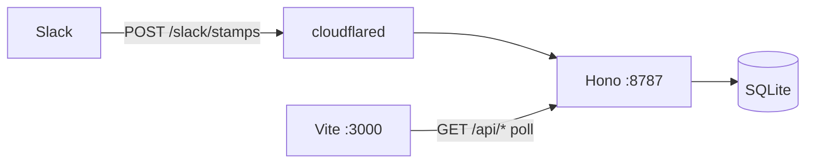

# StampHog without Convex (cloudflared)

Replace Convex with a local Node API + SQLite. Keep the TanStack UI. Slack Event Subscriptions stay HTTP; **cloudflared** is the public HTTPS URL Convex used to be.

Repo: `github.com:mijho/stamphog` only. Do not push to or open PRs against PostHog/stamphog.

## Goal

Local `pnpm dev` + `cloudflared tunnel --url http://localhost:8787` is enough to ingest Slack stamps and show the leaderboard. No Convex account.

## Non-goals

- Socket Mode, Tailscale Funnel, Postgres, auth, hosting
- Changing stamp rules, emoji set, or UI look
- Keeping Convex as an option

## Architecture



Tunnel **only the API**. UI stays on localhost.

Quick tunnels (`trycloudflare.com`) get a new hostname every process. After each restart, paste the new URL into Slack Event Subscriptions. Named tunnel later if you want a stable hostname.

## Stack

| Piece | Choice |
|---|---|
| API | Hono on `:8787` |
| DB | SQLite `data/stamphog.db` via Drizzle + `better-sqlite3` |
| UI | existing Vite / TanStack Start, no Convex client |
| Live updates | React Query `refetchInterval: 3000` |
| Slack | existing HTTP events + signature verify |
| Public URL | `cloudflared tunnel --url http://localhost:8787` |

One API process. Do not serve the webhook through Vite — Slack only needs 8787.

## Preserve these JSON contracts

UI can stay dumb if the API matches Convex.

**`GET /api/leaderboard?windowDays=30`**

```ts
{
  generatedAt: number
  windowDays: number | null
  totals: { events: number; stamps: number; requests: number }
  givers: Array<{
    actorId, displayName, imageUrl?, stampsGiven, approvalsGiven
  }>
  requesters: Array<{
    actorId, displayName, imageUrl?,
    requestsPosted, stampsRequested, approvalsReceived
  }>  // only stampsRequested > 0
}
```

Defaults: `windowDays` optional, `limit` 20, clamp 1–100. Same sort as former `convex/stamps.ts`.

**`GET /api/events?limit=23`**

Merged stamp + request rows, newest first. Keep `_id` (string PK) and `occurredAt`. Stamp rows need giver/requester names+images; request rows need requester + `prUrl`.

**Ingest semantics** (port, don’t reinvent)

- Request dedupe: `slack:request:${channelId}:${messageTs}` — duplicate updates `prUrl` only
- Reaction dedupe: `slack:reaction:${channelId}:${messageTs}:${reaction}:${giverSlackId}`
- Remove: delete by dedupe key, else fallback scan `giverId+requesterId+channelId+source`
- Ignore: non-tracked emoji, no github/graphite URL, thread replies, message subtypes
- `stampCount` always 1

## Schema

Three tables, same fields as former `convex/schema.ts`:

```sql
actors (actor_id PK, display_name, image_url, updated_at)
requests (id, requester_id, channel_id, message_ref, occurred_at, pr_url, dedupe_key UNIQUE)
stamp_events (id, giver_id, requester_id, stamp_count, occurred_at, source, channel_id, pr_url, dedupe_key UNIQUE)
```

Indexes: `occurred_at` on requests and stamp_events; `actor_id` unique.

## File map

Move, then delete `convex/`.

| From | To |
|---|---|
| `convex/slack.ts` | `src/lib/slack-rules.ts` (emoji set, URL extract, dedupe keys) + `server/slack/client.ts` (Slack API) |
| `convex/slackWebhook/security.ts` | `server/slack/security.ts` |
| `convex/slackWebhook/handlers.ts` | `server/slack/handlers.ts` — call ingest fns, not `ctx.runMutation` |
| `convex/slackWebhook/backfill.ts` | `server/slack/backfill.ts` |
| `convex/stamps.ts` ingest/queries | `server/ingest.ts`, `server/queries.ts` |
| `convex/seed.ts` | `server/seed.ts` |
| `convex/http.ts` | `POST /slack/stamps` on Hono |
| `src/features/stamps/queries.ts` | `fetch(`${VITE_API_URL}/api/...`)` |
| `src/router.tsx` | drop `ConvexProvider` / `ConvexQueryClient` |
| `src/routes/index.tsx` | import `STAMP_EMOJIS` from `~/lib/slack-rules` |

New: `server/index.ts`, `server/db.ts`, `server/schema.ts`.

Delete: `convex/`, `convex` + `@convex-dev/react-query` deps, `CONVEX_*` / `VITE_CONVEX_*`.

## Env (`.env.example` only)

```
DATABASE_PATH=./data/stamphog.db
PORT=8787
VITE_API_URL=http://localhost:8787
SLACK_SIGNING_SECRET=
SLACK_BOT_TOKEN=
CHANNEL_IDS=          # backfill only, comma-separated
VITE_PUBLIC_POSTHOG_KEY=
VITE_PUBLIC_POSTHOG_HOST=
```

gitignore `data/` and `.env`. Slack secrets live in the API process env, not Vite.

## Scripts

```
pnpm dev            # concurrently: vite + tsx watch server/index.ts
pnpm dev:web
pnpm dev:api
pnpm seed           # optional --reset
pnpm backfill
```

`cloudflared` is not a package script — run it in a third terminal.

## Work order

1. **DB + ingest** — schema, upsert actor, three ingest fns, unique dedupe. Unit-test dedupe add/remove.
2. **Read APIs** — leaderboard + events matching the JSON above. Seed CLI. Prove UI against seed with no Slack.
3. **Retarget UI** — queries → fetch + poll; strip Convex; move `STAMP_EMOJIS`.
4. **Slack HTTP** — port handlers/security. `url_verification` challenge. Raw body for HMAC (do not `req.json()` first).
5. **cloudflared + Slack app** — tunnel 8787, Request URL `https://<trycloudflare>/slack/stamps`, same bot events/scopes as README.
6. **Backfill CLI** — `CHANNEL_IDS`, 90-day cap, page 200. Ignore README’s `backfillChannel`; only `stamps:backfill` existed.
7. **Cut Convex** — deps, scripts, README, `.env.example`.

## Slack app (unchanged rules)

Bot scopes: `reactions:read`, `channels:history`, `users:read` (`groups:history` if private).

Bot events: `reaction_added`, `reaction_removed`, `message.channels` (`message.groups` if private).

Invite the bot. Test with a **top-level** github/graphite URL and `:white_check_mark:` unless the workspace has the custom stamp emoji.

## Local run

```bash
pnpm install
pnpm dev
# other terminal
cloudflared tunnel --url http://localhost:8787
```

Paste `https://<host>/slack/stamps` into Slack → Event Subscriptions → verify.

Optional: `pnpm seed` before Slack.

## Acceptance

- `pnpm seed` fills leaderboard with no Slack
- Slack URL verification succeeds through cloudflared
- PR link + tracked reaction appears within one poll interval
- Removing the reaction drops the stamp
- Duplicate events don’t double-count
- `pnpm backfill` is idempotent
- Repo has zero `convex` dependency

## Pitfalls

- **Raw body** for `v0:${timestamp}:${rawBody}` HMAC; JSON parse after verify
- Slack 3s timeout — keep ingest fast; Slack API lookups are the slow part
- Bot not in channel → `conversations.history` fails → reactions ignored
- Thread replies ignored on purpose
- Quick tunnel hostname changes every `cloudflared` restart
- Most tracked emoji are PostHog customs; ✅ always works
