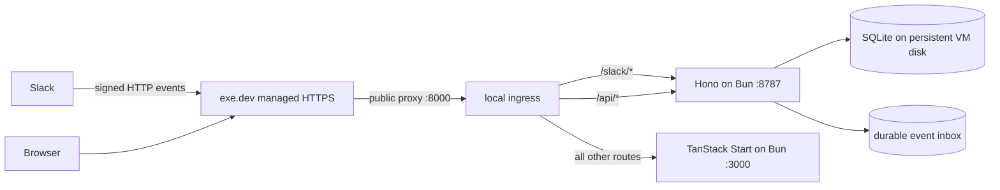
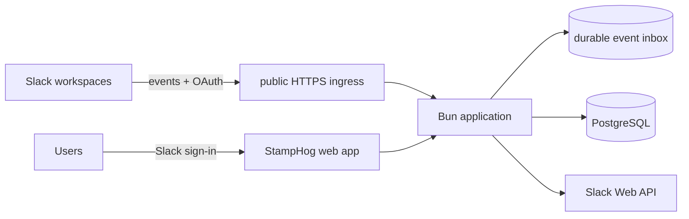

# StampHog delivery plan

_Draft for review — 29 August 2026_

## Outcome

Turn StampHog from a local, single-workspace side project into a tested Bun application that:

- runs reproducibly on macOS and Linux;
- has a persistent staging deployment on an [exe.dev](https://exe.dev/) VM;
- keeps SQLite as the simple local/single-VM database option;
- supports PostgreSQL for a multi-workspace service deployment;
- is installed through Slack OAuth rather than asking every customer to create an app;
- can progress from an unlisted public pilot to a Slack Marketplace application;
- addresses every correctness, privacy, reliability, testing, and maintainability item in [`research.md`](research.md).

The sequence deliberately establishes a green local baseline before changing behavior, then creates a stable staging environment before beginning the multi-tenant redesign.

## Delivery principles

1. **Working software is the first gate.** Do not combine the Bun migration, Slack reliability changes, multi-tenancy, and PostgreSQL into one rewrite.
2. **One reversible step at a time.** Preserve API behavior with contract tests before replacing runtimes, database drivers, or schemas.
3. **HTTP is the supported Slack transport.** Remove Socket Mode from the main architecture. HTTP fits exe.dev, distributed Slack apps, durable event ingestion, and future horizontal scaling.
4. **SQLite stays first-class.** It remains the default for local development and single-VM deployments. PostgreSQL becomes the recommended service database once multi-workspace support exists.
5. **Database portability lives behind an application boundary.** Drizzle uses dialect-specific table definitions, so SQLite and PostgreSQL will have separate schemas/migrations backed by one shared repository contract and test suite.
6. **No secrets in the repository.** Keep examples in `.env.example`; put real values in local private files, VM-owned environment files, and CI secret storage.
7. **The leaderboard is a playful nudge, not a performance score.** Keep product copy and future metrics aligned with this principle.

## Target architecture

### Staging: one exe.dev VM with SQLite

exe.dev supplies a persistent Linux filesystem and managed HTTPS. Its proxy exposes one selected public port, so the VM needs one ingress on port 8000 that routes to the web and API processes. The Slack webhook remains public and protected by Slack signatures. The staging UI and read APIs require an authenticated exe.dev user header; unauthenticated browser traffic is sent through exe.dev login. Browser API calls use same-origin `/api/*`, eliminating wildcard CORS.

The initial ingress can be Caddy because its configuration is small and auditable. The application remains two processes during the migration; combining Hono and TanStack Start can be evaluated later and is not required to reach a reliable deployment.

Relevant exe.dev behavior is documented in its [persistent disk](https://exe.dev/docs/serverful), [HTTPS proxy](https://exe.dev/docs/proxy), and [sharing](https://exe.dev/docs/cli-share) guides.

### Service: multi-workspace with PostgreSQL

The service deployment uses one centrally managed Slack app. Each workspace installs it through OAuth, producing a workspace-specific bot token stored encrypted at rest. Every actor, channel, request, stamp, event, and query is scoped by workspace. SQLite can still run this model for local development or small self-hosted installations; PostgreSQL is the production default for concurrent service workloads.

## Milestones and review gates

| Gate | Demonstrates | Required before |
|---|---|---|
| A — Local baseline | Fresh Bun install, tests, type check, lint, build, seed, API and UI all work locally | Behavior and deployment changes |
| B — Secure staging | Stable exe.dev URL, protected dashboard, signed Slack events, persistent SQLite, deploy/rollback/backup runbook | Multi-workspace work |
| C — Multi-workspace pilot | OAuth installation, tenant isolation, token security, two-workspace end-to-end test | Public pilot |
| D — Database parity | The same repository contract and behavior suite pass on SQLite and PostgreSQL | Production service launch |
| E — Marketplace ready | Usage threshold, legal/support pages, security evidence, onboarding, operational readiness | Slack Marketplace submission |

## Phase 0 — Establish a green Bun baseline

This phase changes tooling and runtime but should not intentionally change product behavior.

### Runtime and package management

- Install and pin one exact stable Bun release for local development, CI, and exe.dev. Record it in `.bun-version` and `package.json` metadata.
- Run `bun install`, generate `bun.lock`, and verify dependency resolution before removing `pnpm-lock.yaml`.
- Replace all `pnpm` commands in scripts and documentation with Bun equivalents.
- Remove `tsx` once Bun executes the TypeScript entry points directly.
- Replace `concurrently` with a small Bun development launcher or another Bun-compatible parallel runner.
- Add `@types/bun`; retain `@types/node` only for Node-compatible APIs still used by dependencies.

### Bun compatibility changes

- Replace `@hono/node-server` with Hono's native Bun entry point/export. Hono officially supports Bun without the Node adapter ([Hono Bun guide](https://hono.dev/docs/getting-started/bun)).
- Replace `better-sqlite3` with Bun's built-in `bun:sqlite` driver and Drizzle's `drizzle-orm/bun-sqlite` adapter. Both projects document this integration ([Bun SQLite](https://bun.sh/docs/runtime/sqlite), [Drizzle Bun SQLite](https://orm.drizzle.team/docs/sqlite/connect-bun-sqlite)).
- Replace `node:process.loadEnvFile`, which Bun does not currently implement, with Bun's environment loading behavior plus explicit environment validation.
- Convert the four `node:test` tests to `bun:test` and make `bun test` the canonical runner.
- Change the TanStack Start Nitro preset from `vercel` to `bun`; React 19 already satisfies TanStack's Bun deployment requirement ([TanStack Start Bun hosting](https://tanstack.com/start/latest/docs/framework/react/guide/hosting)).
- Remove `@slack/socket-mode`, `SLACK_APP_TOKEN`, and the automatic Socket Mode import unless a later, explicitly separate development tool proves necessary.

### Baseline validation

- Add a startup-time environment schema with clear errors for invalid ports, database selection, Slack credentials, URLs, and retention values.
- Create versioned Drizzle SQLite migrations that reproduce the current three-table schema; stop using only `CREATE TABLE IF NOT EXISTS` as migration management.
- Preserve a copy/backup of any existing local SQLite database before applying the first managed migration.
- Run and record:
  - `bun install --frozen-lockfile` from a clean checkout;
  - `bun test`;
  - TypeScript checking;
  - lint/format checking;
  - production build;
  - database migration and deterministic seed;
  - API smoke checks for health, leaderboard, and recent events;
  - browser smoke check for both themes, both leaderboards, date windows, and recent activity.

### Gate A acceptance

- A new contributor can follow the README from a clean macOS or Linux checkout without Node or pnpm.
- All quality commands pass with the pinned Bun release.
- Seeded UI and API responses match the pre-migration contracts.
- The old pnpm lockfile, Node server adapter, `better-sqlite3`, `tsx`, and Socket Mode dependency are gone.

## Phase 1 — Correctness, privacy, and Slack reliability

Complete this locally before exposing the persistent staging system.

### Webhook correctness

- Verify the Slack signature against the raw body before parsing JSON.
- Return URL-verification signature failures rather than reflecting the challenge.
- Add signed request fixtures for valid, invalid, stale, malformed, and URL-verification requests.
- Retain Slack's top-level `event_id`, `team_id`, retry headers, and event timestamp in the inbound model.

### Durable acknowledgement and idempotency

- Add an `event_inbox` table with a unique Slack `event_id`, payload, workspace/team ID, receive time, processing state, attempt count, and last error.
- For HTTP delivery: verify, persist, return 200 within Slack's three-second deadline, then process asynchronously in the Bun process.
- Recover pending jobs after restart and move permanently failing jobs to an inspectable failed state.
- Keep domain-level request/reaction dedupe keys as a second line of protection.
- Replace the broad `reaction_removed` fallback. A repeated removal must become a no-op and must never remove stamps from another message.

### Consistent domain rules

- Decide that self-stamps are either counted or ignored everywhere; the recommended rule is to ignore them in both live ingestion and backfill.
- Document that backfill lacks reaction timestamps. Use the PR message timestamp as the ranking-time approximation, store `timestampSource` as either `slack_event` or `message_time_approximation`, and retain a separate `ingestedAt`. Expose enough metadata for the API/UI to disclose the approximation rather than silently mixing semantics.
- Validate actual GitHub pull-request and Graphite review paths instead of accepting any URL on those hosts.
- Reconcile the README with the 20 tracked emoji and document that zero-stamp requesters are intentionally excluded from the requester leaderboard. Plan a separate future “Awaiting review” or review-coverage view for unstamped PRs rather than ranking people with a zero score.

### Read-side privacy

- Remove wildcard CORS and default browser calls to same-origin APIs.
- Add a read-auth middleware boundary. Local development may use an explicit development identity; exe.dev staging uses verified proxy identity headers; the future service uses Slack-based user sessions.
- Authorize access by workspace on the server. A future workspace ID supplied only by the browser is never sufficient authorization.
- Avoid logging Slack tokens, full event payloads, or private message text.

### Backfill reliability

- Follow `next_cursor` whenever it is present, regardless of returned page length.
- Handle Slack `429` responses using `Retry-After`, bounded retries, jitter, and progress persistence.
- Distinguish not-in-channel, missing-scope, rate-limit, missing-message, and true thread-reply outcomes in logs/results.
- Make backfill an explicit admin operation with dry-run output and per-workspace/channel audit records.

### Tests added in this phase

- Slack URL/rule unit tests.
- Signature and HTTP dispatch tests.
- Add/remove/retry idempotency tests, including the cross-message deletion regression.
- Window boundary and query-limit tests.
- Backfill cursor, rate-limit, user-cache, and resume tests.
- Live/backfill parity tests for all intentional shared rules.

## Phase 2 — Deploy a protected SQLite staging environment to exe.dev

### VM topology

- Create one named Linux VM in the London region with enough disk for releases, logs, backups, and SQLite growth.
- Give the VM a stable `*.exe.xyz` hostname for staging; do not depend on a temporary Cloudflare hostname.
- Store the live SQLite database under a persistent service-owned path such as `/var/lib/stamphog/stamphog.db`, outside release directories.
- Run the web, API/worker, and ingress as supervised services with automatic restart and clean shutdown.
- Configure exe.dev's public HTTPS proxy to port 8000. Public proxying is required for Slack, so path-level authorization must live in the ingress/application rather than relying on the whole VM being private.

### Repository-owned deployment assets

Add a `deploy/exe/` directory containing:

- an idempotent first-time provisioning script;
- service definitions for the TanStack web process and Hono API/worker;
- an ingress configuration routing `/slack/*` publicly, `/health` minimally, `/api/*` with authentication, and other routes to the protected UI;
- a release script that uploads or checks out an immutable commit, runs `bun install --frozen-lockfile`, builds, migrates, switches a `current` symlink, restarts, and health-checks;
- a rollback command that switches to the previous release without rolling the database backward;
- log inspection, database backup, restore, and smoke-test commands.

### Secrets and configuration

- Keep VM secrets in a root/service-owned environment file with restrictive permissions, never in a release directory.
- Use a dedicated Slack development app and test workspace for staging.
- Required staging configuration includes the Slack signing secret/token, database URL/path, public origin, internal API origin, PostHog settings if enabled, allowed exe.dev users, and retention policy.
- Keep the staging UI private to an allow-list of exe.dev identities while allowing Slack's signed webhook path through without exe.dev login.

### Database safety

- Enable WAL and an explicit busy timeout.
- Add a health check that verifies a trivial database query and migration version, not only process liveness.
- Create consistent SQLite snapshots through the SQLite backup mechanism or `VACUUM INTO`; do not copy only the main database file while WAL writes may be active.
- Copy backups off the VM and test restoration into a fresh database. The provider choice is deferred now but must be selected before Gate B is complete.

### Stampy.exe.xyz concrete provisioning plan

The `stampy` VM already exists on exe.dev and is connected directly to
`mijho/stamphog`, so provisioning is cloning/building/running rather than
creating the VM. exe.dev supplies the persistent disk, managed HTTPS, and a
proxy that exposes **one** selected public port; we do not run Caddy — the
exe.dev proxy is the ingress. The current repo produces two processes:

- **Web** — `bun run .output/server/index.mjs` (TanStack Start + Nitro, Bun
  preset). Serves the UI and proxies `/api/**` (and must also proxy
  `/slack/**`) to the internal API. Listens on `PORT` (default Nitro 3000).
- **API/worker** — `bun run server/index.ts` (Hono on Bun). Serves
  `/api/leaderboard`, `/api/events`, `POST /slack/stamps`, runs the durable
  inbox worker and backfill. Listens on `API_PORT` (default 8787).

Plan:

1. **Make the web server the single public entry.** exe.dev proxy → `stampy`
   port `PORT` (3000). Add a `routeRules` entry `/slack/**` →
   `${VITE_API_URL}/slack/**` alongside the existing `/api/**` rule, so Slack
   can POST to `https://stampy.exe.xyz/slack/stamps` and the web forwards it
   to the internal API. Bind the API to `127.0.0.1` only (it is never
   directly public; ports 3000–9999 on exe.dev are VM-access-only anyway).
2. **Set `VITE_API_URL` at build time.** `SERVER_API_BASE` in
   `src/features/stamps/queries.ts` is inlined from `import.meta.env.VITE_API_URL`
   during `vite build`, so the release script must build with
   `VITE_API_URL=http://127.0.0.1:${API_PORT}`. At runtime the SSR fetch and
   the web proxy both target the internal API.
3. **Repository deploy assets (`deploy/exe/`).** Add:
   - `provision.sh` — idempotent first-time setup: install Bun if missing,
     clone/pull the repo, `bun install --frozen-lockfile`, create
     `/var/lib/stamphog` (DB), `/var/log/stamphog`, and a release dir; write
     the service env file; install systemd units; `ssh exe.dev domain add
     stampy stampy.exe.xyz` (DNS CNAME `stampy.exe.xyz → stampy.exe.xyz`) and
     `ssh exe.dev share set-public stampy`.
   - `web.service` / `api.service` — systemd units (Type=simple,
     `Restart=always`, `EnvironmentFile=/etc/stamphog.env`, working dir =
     release `current/`, `ExecStart` for each process).
   - `release.sh` — check out an immutable commit, `bun install
     --frozen-lockfile`, `VITE_API_URL=http://127.0.0.1:8787 bun run build`,
     migrate (auto on first `getDb()`), swap a `current` symlink, restart both
     services, health-check `https://127.0.0.1:3000/health` (add a `/health`
     to the web server or health-check `/`).
   - `rollback.sh` — point `current` at the previous release and restart
     (database is never rolled back).
   - `backup.sh` / `restore.sh` — `VACUUM INTO`/`.backup` a WAL-consistent
     SQLite snapshot to `/var/backups/stamphog`; off-VM transfer deferred per
     decision log #2.
4. **Service env file** `/etc/stamphog.env` (root-owned `0600`, never in the
   repo): `PORT=3000`, `API_PORT=8787`,
   `VITE_API_URL=http://127.0.0.1:8787`, `DATABASE_PATH=/var/lib/stamphog/
   stamphog.db`, `SLACK_BOT_TOKEN`, `SLACK_SIGNING_SECRET` (or the exe.dev
   Slack Bot integration host — see decisions), and read-auth settings per
   the UI-privacy decision below.
5. **Slack app (external, not in repo).** Point HTTP Event Subscriptions at
   `https://stampy.exe.xyz/slack/stamps`; grant `reactions:read`,
   `channels:history`, `users:read`, `chat:write`; set the signing secret.
   Install the app into the staging workspace and invite it to the channel.
6. **Validation (Gate B exercise).** URL verification; qualifying message;
   reaction add; duplicate delivery; removal and removal retry; process restart
   with a queued event; backfill; confirm unauthenticated users cannot read
   protected surfaces while Slack still reaches the webhook; confirm SQLite
   survives restart and a new release; one rollback and one restore rehearsal.

#### Decisions to confirm for the stampy.exe.xyz pilot

- **UI/read API visibility.** Plan Gate B says protect the dashboard with
  exe.dev identity + email allow-list. But a stamp leaderboard is playful and
  may be intended to be publicly viewable. Options: (a) public leaderboard
  (`READ_AUTH_ALLOW_ANONYMOUS=true`, default) — simplest pilot; (b) exe.dev
  identity-protected (`READ_AUTH_ALLOW_ANONYMOUS=false` + the header exe.dev
  injects for authenticated proxy users and an email allow-list). The exact
  identity header name exe.dev sets must be confirmed during implementation.
- **Slack credential handling.** (a) Plain VM env secrets
  (`SLACK_BOT_TOKEN` + `SLACK_SIGNING_SECRET` in `/etc/stamphog.env`) — simple,
  secrets stay out of the repo; (b) exe.dev **Slack Bot integration** so the
  `xoxb-`/`xapp-` tokens live off-VM and the VM calls
  `https://<integration>.int.exe.xyz/api/...` — requires a small change to
  route the Slack Web API base (`SLACK_API_BASE`) in `client.ts`. The webhook
  still needs the signing secret unless we later adopt Socket Mode (Phase 0
  removed Socket Mode; HTTP stays the supported transport).

### Deployment validation

- Install the staging Slack app with HTTP Event Subscriptions pointed at the stable exe.dev webhook URL.
- Exercise URL verification, qualifying message, reaction add, duplicate delivery, removal, removal retry, process restart with a queued event, and backfill.
- Confirm that unauthenticated users cannot read the UI or `/api/*` and that Slack can still reach the webhook.
- Confirm SQLite data survives application restarts and a new release.
- Perform one deploy rollback and one database restore rehearsal.

### Gate B acceptance

- A documented command deploys a known commit to staging and reports health.
- The staging URL is stable, HTTPS is managed by exe.dev, and Cloudflare Quick Tunnels are no longer part of normal testing.
- Dashboard/read APIs are protected, Slack ingestion meets the acknowledgement deadline, and persistent SQLite has a tested restore path.

## Phase 3 — CI, release discipline, and service observability

- Add GitHub Actions using the pinned Bun version for install, test, type check, lint, and build.
- Make exe.dev deployment manual (`workflow_dispatch`) first; enable deployment from `main` only after repeated successful releases.
- Use an exe.dev-scoped deploy credential in CI and least-privilege repository secrets.
- Gate deployment on all quality jobs and migration validation.
- Add structured logs with request/event correlation IDs, workspace ID, event ID, processing duration, Slack API outcome, and retry count—without event bodies or tokens.
- Add metrics for webhook acknowledgement latency, queue depth/age, failed jobs, Slack API rate limits, backfill progress, API latency, and database errors.
- Add a retention job with these defaults: successfully processed raw Slack payloads for 7 days; failed payloads for 30 days; normalized requests, stamps, and actor profiles for 90 days; operational logs for 30 days; security/admin audit logs for 90 days; and backups for 30 days. Remove active workspace data promptly after uninstall or an accepted deletion request; encrypted backup copies expire through the same 30-day cycle. A later workspace setting may extend normalized history without extending raw-payload retention.
- Add a release runbook covering deploy, rollback, restore, Slack incident handling, token rotation, and exe.dev outage handling.

## Phase 4 — Multi-workspace data and authorization foundation

This is the first intentionally breaking data-model phase. Complete it on SQLite and staging before adding PostgreSQL.

### Tenant-aware schema

Add at least:

- `workspaces`: Slack team/enterprise identifiers, name/domain metadata, status, plan/configuration, retention settings, timestamps;
- `installations`: encrypted bot token, bot user, granted scopes, installer, token/key version, install/update/revoke timestamps;
- `channels`: workspace-scoped enabled channels and backfill state;
- `workspace_members`: identities allowed to view/administer a workspace dashboard;
- `oauth_states`: short-lived, one-use OAuth state records;
- `event_inbox`: globally unique Slack event IDs plus workspace processing state;
- workspace IDs on actors, requests, and stamps, with composite foreign keys and unique constraints.

All queries, dedupe keys, caches, backfills, fixture data, and analytics properties must include workspace scope. Add database tests proving one workspace cannot read, mutate, remove, or aggregate another workspace's data.

### Installation and user authentication

- Implement Slack OAuth v2 install and callback endpoints with one-time `state` validation.
- Exchange the authorization code server-side and store each workspace installation securely.
- Route incoming events by envelope `team_id`/`enterprise_id` to the correct installation token.
- Handle reinstall, scope change, `app_uninstalled`, token revocation, workspace rename, and Enterprise Grid identifiers.
- Use Slack OpenID Connect for service user identity. Keep this user sign-in flow separate from the administrator's Slack app installation OAuth flow. Derive workspace access server-side from the signed-in Slack identity and stored workspace authorization.
- Require workspace admin authorization for configuration, channel selection, backfill, retention, and deletion.

### Token security

- Encrypt Slack bot tokens at the application layer with an independently managed master key and key version.
- Never return tokens through APIs or log them.
- Document key rotation and forced workspace reauthorization.
- Separate staging and production Slack applications, client secrets, signing secrets, encryption keys, and databases.

### Gate C acceptance

- Two unrelated Slack workspaces can install the central staging app through OAuth.
- Their events use the correct bot tokens and produce isolated leaderboards.
- A signed-in user can access only authorized workspaces.
- Uninstalling one workspace stops its processing without affecting the other.

## Phase 5 — Add PostgreSQL as a second database option

### Storage boundary

- Define domain-oriented repository interfaces for actors, requests, stamps, workspace installations, inbox jobs, leaderboard queries, recent events, retention, and backfill state.
- Make repository operations asynchronous even when the Bun SQLite implementation completes synchronously.
- Keep shared DTOs and domain rules outside dialect-specific modules.
- Add separate Drizzle SQLite and PostgreSQL schema definitions and migration histories. Drizzle has no dialect-neutral table object, so avoid pretending one schema can serve both ([Drizzle schema guidance](https://orm.drizzle.team/docs/sql-schema-declaration)).
- Select the driver from an explicit database URL/configuration: SQLite file URLs use `bun:sqlite`; PostgreSQL URLs use Bun SQL/Drizzle's Bun SQL adapter ([Bun SQL](https://bun.sh/docs/runtime/sql), [Drizzle Bun SQL](https://orm.drizzle.team/docs/connect-bun-sql)).

### Parity and migration

- Run the same repository contract suite against temporary SQLite and PostgreSQL databases in CI.
- Test constraints, timestamps, sorting/tie-breaking, transactions, concurrent inbox claims, idempotency, retention, and migrations on both dialects.
- Move leaderboard aggregation into SQL while preserving the current response contract and deterministic ordering.
- Add an export/import command for moving one or all workspaces from SQLite to PostgreSQL, with row counts, checksums, dry run, and resumability.
- Keep SQLite single-process job claiming simple; use PostgreSQL row locking/skip-locked semantics for multiple workers.

### Deployment policy

- SQLite remains the default for local development, demos, and a single Bun process on one persistent VM.
- PostgreSQL is required before running multiple application instances and recommended for the hosted multi-workspace service.
- The hosted production service uses managed PostgreSQL and must not place its only database copy on the application VM. Local and CI parity tests use disposable PostgreSQL containers; staging adds a separate PostgreSQL test environment when parity work begins. The provider and backup destination remain deferred, and the application accepts a standard connection URL rather than coupling itself to one vendor.

### Gate D acceptance

- All repository and end-to-end behavior tests pass on both database engines.
- A staging dataset can be exported from SQLite, imported into PostgreSQL, and produce identical leaderboard/API results.
- Switching database engines requires configuration plus migrations, not application behavior changes.

## Phase 6 — Public Slack application rollout

“Official public application” has two milestones: an unlisted distributed pilot, then Slack Marketplace listing. Slack requires OAuth for installation into other workspaces and recommends an unlisted app for early customers before Marketplace review ([Slack app distribution](https://docs.slack.dev/app-management/distribution/)).

### Canonical Slack app package

- Commit a Slack app manifest describing display information, OAuth redirect URLs, bot scopes, event subscriptions, and webhook URLs. This is the operator's source of truth; customers install the centrally managed app and do not create their own copy.
- Keep app credentials out of the manifest/repository.
- Use HTTP Events API only.
- Re-evaluate every requested scope for least privilege. Document why `reactions:read`, `users:read`, and each channel-history scope is needed.
- Treat backfill as an explicit workspace-admin action that is disabled during installation until the admin selects channels and consents. Cap the unlisted pilot at 30 days and process it through the rate-limited background queue; after Marketplace approval, allow up to 90 days where Slack's applicable limits permit. Live event ingestion always has priority over backfill. The pilot must work without assuming 200-message pages or high request rates.

### Installation and onboarding experience

- Add a public landing/install page and a direct OAuth start URL.
- After installation, show the installed workspace, granted scopes, bot invitation instructions, channel selection, a test-event check, data collected, retention policy, and how to uninstall/delete data.
- Handle workspaces that require admin approval.
- Provide useful Slack-native confirmation/help surfaces so the app has clear functionality inside Slack, not only an external dashboard.

### Public-pilot requirements

- Privacy policy, terms of service, support/contact page, security overview, subprocessors/data-storage description, and data-deletion process.
- Published incident/support expectations and a monitored support channel.
- Automated token redaction, dependency/security scanning, backup/restore evidence, tenant-isolation tests, and a vulnerability-reporting path.
- At least a small invited cohort using the unlisted OAuth installation flow; do not submit an unfinished private beta to the Marketplace.

### Marketplace submission

- Meet Slack's current eligibility threshold before submission. As of this review, Slack says Marketplace apps should already have at least 10 active workspaces and 10 weekly active users.
- Prepare listing copy, icon/screenshots, scope justifications, direct install redirect, test credentials/instructions, onboarding evidence, privacy/security answers, and support URLs.
- Pass Slack's automated checks, preliminary review, functional review, and any advanced security review.
- Treat scope, event-subscription, OAuth, or listing changes after approval as controlled release work because they may require review updates.

Slack's current requirements are described in its [Marketplace distribution guide](https://docs.slack.dev/slack-marketplace/distributing-your-app-in-the-slack-marketplace/), [guidelines](https://docs.slack.dev/slack-marketplace/slack-marketplace-app-guidelines-and-requirements/), and [review guide](https://docs.slack.dev/slack-marketplace/slack-marketplace-review-guide/).

### Gate E acceptance

- A new workspace can discover/install the app, complete OAuth and onboarding, configure channels, receive events, and view an isolated dashboard without operator intervention.
- Uninstall/reinstall, token revocation, deletion, and support flows have been exercised.
- Marketplace documentation and functional test instructions match production behavior.

## Phase 7 — Service hardening after public pilot

- Add horizontal application/worker scaling only after PostgreSQL inbox claiming is proven.
- Add per-workspace quotas and fair Slack API scheduling so one backfill cannot starve live events or other tenants.
- Add workspace-level data export/deletion and auditable admin actions.
- Add availability/error budgets and alerts based on webhook latency, queue age, and failed processing.
- Review whether polling should remain or be replaced by server-sent updates; do this only if three-second polling becomes a measured problem.
- Optimize SQL queries and indexes from production traces rather than anticipated scale.
- Evaluate billing/plans only after the installation and usage model is understood; billing is not required for the technical public-app milestone.

## Product guardrails and success measures

- Preserve the playful disclaimer and avoid presenting rankings as employee performance evaluation.
- Ignore self-stamps and monitor reciprocal/repetitive stamping patterns.
- Consider team-scoped or opt-in leaderboards and participation/coverage views alongside absolute totals.
- Track outcome measures such as review coverage and median time to first approval, not only stamp volume.
- Provide workspace admins with visibility into tracked channels, rules, retention, and deletion.
- Minimize stored Slack data: retain the qualifying URL and required identities, not full message history.

## Traceability to `research.md`

| Research finding | Planned response |
|---|---|
| Public tunnel exposes read APIs | Phase 1 same-origin/read auth; Phase 2 path-protected exe.dev ingress |
| Slack work occurs before 3-second acknowledgement | Phase 1 durable event inbox and immediate 200 |
| Retried removal can over-delete | Phase 1 removal regression test and exact/no-op semantics |
| URL verification ignores failed signature | Phase 1 verify-before-parse and failure response |
| Backfill pagination/rate limits are brittle | Phase 1 cursor authority, `Retry-After`, resume state |
| Live/backfill semantics differ | Phase 1 explicit self-stamp and timestamp rules |
| Docs/tooling drift | Phase 0 Bun/README cleanup; Phase 1 emoji/requester decisions |
| No versioned migrations | Phase 0 Drizzle SQLite migrations; Phase 5 dual-dialect migrations |
| No CI | Phase 3 Bun quality and deployment workflows |
| Indefinite retention | Phase 3 retention policy/job and restore runbook |
| In-memory aggregation | Phase 5 SQL aggregation after dialect parity |
| Server types imported by frontend | Phase 5 shared DTO/domain module |
| Single-workspace IDs and tokens | Phase 4 workspace schema, OAuth, encryption, tenant authorization |
| Gamification can distort behavior | Product guardrails and outcome-oriented measures |

## Decision log

1. **Staging hostname — resolved:** use the generated stable `*.exe.xyz` name for the initial deployment. Defer a dedicated custom domain until the public pilot/customer-facing rollout.
2. **Off-VM backups — deferred:** choose the storage provider later. Backups must still be encrypted before upload, stored away from the application VM, restorable through provider-neutral tooling, and governed by the agreed retention policy.
3. **Retention — resolved:** keep successfully processed raw Slack payloads for 7 days, failed payloads for 30 days, normalized requests/stamps/actor profiles for 90 days, operational logs for 30 days, security/admin audit logs for 90 days, and backups for 30 days. Promptly remove active data after uninstall or an accepted deletion request; residual encrypted copies expire with the backup cycle. Workspaces may later extend normalized-history retention without extending raw-payload retention.
4. **PostgreSQL topology — resolved:** use disposable PostgreSQL containers for local and CI tests; retain SQLite for initial exe.dev staging; add a separate PostgreSQL staging environment during parity work; and use managed PostgreSQL for the hosted production service. Do not run the only production database copy on the application VM. Choose the managed provider later.
5. **Dashboard identity — resolved:** use exe.dev identity headers plus an explicit email allow-list for staging. Use Slack OpenID Connect for the public service, with workspace access derived server-side from Slack identity and stored authorization. Keep administrator installation permissions in a separate Slack OAuth flow.
6. **Backfill product policy — resolved:** keep backfill as an explicit workspace-admin action, disabled by default during installation and requiring channel selection plus consent. Cap the unlisted pilot at 30 days; after Marketplace approval, allow up to 90 days where Slack's limits permit. Run it through the rate-limited background queue and always prioritize live events.
7. **Zero-stamp requesters — resolved:** keep them out of the requester leaderboard and update the README to match. Represent unstamped PRs later through a separate “Awaiting review” or review-coverage view so the UI presents an actionable queue instead of a zero-score ranking.
8. **Historical data semantics — resolved:** keep backfilled stamps in time-window rankings using the PR message timestamp as an explicit approximation. Store `occurredAt`, `timestampSource` (`slack_event` or `message_time_approximation`), and `ingestedAt`; disclose approximate historical timing through the API/UI.

## Explicitly deferred

- Billing and paid plans.
- Horizontal scaling before PostgreSQL is ready.
- Realtime push updates before polling is shown to be inadequate.
- Native mobile/desktop clients.
- Supporting arbitrary review hosts beyond GitHub and Graphite.
- A second Slack transport alongside HTTP.

## First implementation slice

Once this plan is approved, begin only with Phase 0:

1. Pin/install Bun and create the Bun lockfile.
2. Make Hono, environment loading, SQLite, tests, and TanStack production output Bun-native.
3. Run the complete local verification matrix and fix baseline failures.
4. Update README commands and record the green baseline.

Do not begin exe.dev provisioning or multi-tenant schema work until Gate A passes.

## Project to-do list

> **Current focus:** Phase 2 — deploy a protected SQLite staging environment to `stampy.exe.xyz` on exe.dev (Gate A passed).
>
> Check an item only when its implementation, relevant tests, and documentation are complete. Check a gate only after every acceptance criterion for that gate has been demonstrated.

### Planning and decisions

- [x] Research the existing codebase and record findings in `research.md`.
- [x] Agree the phased delivery plan and implementation gates.
- [x] Complete the eight-question architecture/product decision review.
- [ ] Select encrypted off-VM backup storage before Gate B.
- [ ] Select the managed PostgreSQL provider before production service deployment.

### Phase 0 — Green Bun baseline

- [x] Install and pin the agreed stable Bun version.
- [x] Install dependencies with Bun and commit `bun.lock`.
- [x] Convert package scripts and local development commands from pnpm/Node to Bun.
- [x] Replace the Node Hono adapter with Hono's Bun-native server entry point.
- [x] Replace `better-sqlite3` with `bun:sqlite` and the Drizzle Bun adapter.
- [x] Replace Node-specific environment loading and add validated startup configuration.
- [x] Convert the existing tests from `node:test` to `bun:test`.
- [x] Change the TanStack Start production target from Vercel/Node to Bun.
- [x] Remove Socket Mode, `SLACK_APP_TOKEN`, and `@slack/socket-mode`.
- [x] Add versioned Drizzle migrations for the existing SQLite schema.
- [x] Preserve/backup any existing local database before applying managed migrations.
- [x] Remove pnpm/Node-only dependencies and `pnpm-lock.yaml` after parity is proven.
- [x] Pass a clean `bun install --frozen-lockfile`.
- [x] Pass tests, type checking, linting, and the production build.
- [x] Run migrations and deterministic seed data successfully.
- [x] Smoke-test health, leaderboard, recent events, themes, tabs, and date windows locally.
- [x] Update the README with the verified Bun setup and commands.
- [x] **Gate A:** approve the reproducible local Bun baseline.

### Phase 1 — Correctness, privacy, and Slack reliability

- [x] Verify Slack signatures against the raw body before JSON parsing.
- [x] Reject invalid URL-verification signatures.
- [x] Retain Slack `event_id`, `team_id`, retry metadata, and event timestamps.
- [x] Add the durable `event_inbox` schema and migrations.
- [x] Acknowledge verified Slack events within three seconds before processing.
- [x] Add background processing, retries, restart recovery, and failed-job inspection.
- [x] Make repeated reaction removal an exact no-op without cross-message deletion.
- [x] Ignore self-stamps consistently in live ingestion and backfill.
- [x] Store `occurredAt`, `timestampSource`, and `ingestedAt` for historical events.
- [x] Validate GitHub PR and Graphite review paths rather than hostname alone.
- [x] Confirm and document the 20 tracked emoji.
- [x] Keep zero-stamp users out of the requester leaderboard and correct the README.
- [x] Remove wildcard CORS and use same-origin browser API calls.
- [x] Add the server-side read-auth and workspace-authorization boundary.
- [x] Redact tokens, event bodies, and private message text from logs.
- [x] Make backfill cursor-driven, rate-limit-aware, resumable, and auditable.
- [x] Add rule, webhook, signature, retry, query-window, and backfill tests.
- [x] Pass the complete local reliability and privacy test suite.

### Phase 2 — Protected exe.dev SQLite staging

- [ ] Create the London exe.dev staging VM and stable `*.exe.xyz` hostname.
- [ ] Create persistent service, release, configuration, log, and database directories.
- [ ] Add the idempotent `deploy/exe/` provisioning assets.
- [ ] Configure supervised Bun web and API/worker processes.
- [ ] Configure the port-8000 ingress and route web, API, health, and Slack paths.
- [ ] Protect the UI/read APIs with exe.dev identity and an email allow-list.
- [ ] Keep signed Slack webhook routes publicly reachable.
- [ ] Configure same-origin browser APIs and the internal SSR API origin.
- [ ] Install staging secrets outside the repository and release directories.
- [ ] Add immutable release, migration, health-check, and rollback commands.
- [ ] Enable SQLite WAL, busy timeout, and migration-aware readiness checks.
- [ ] Implement consistent encrypted SQLite backups and off-VM transfer.
- [ ] Test restoration into a fresh SQLite database.
- [ ] Configure the dedicated staging Slack app for HTTP Events API delivery.
- [ ] Complete the Slack add/duplicate/remove/retry/restart/backfill staging exercise.
- [ ] Demonstrate data persistence across process restart and application release.
- [ ] Rehearse one release rollback and one database restore.
- [ ] **Gate B:** approve the secure, recoverable exe.dev staging deployment.

### Phase 3 — CI, releases, and observability

- [ ] Add Bun-based GitHub Actions for install, tests, types, lint, and build.
- [ ] Validate migrations in CI and gate deployments on all quality jobs.
- [ ] Add a manual exe.dev deployment workflow with a scoped deploy credential.
- [ ] Promote `main` deployments only after repeated successful manual releases.
- [ ] Add structured, redacted logs and request/event correlation IDs.
- [ ] Add metrics for acknowledgement latency, queue health, Slack limits, API latency, and database errors.
- [ ] Implement the agreed payload, history, log, audit-log, and backup retention periods.
- [ ] Implement prompt active-data deletion after uninstall or an accepted deletion request.
- [ ] Write and rehearse deploy, rollback, restore, Slack incident, token-rotation, and exe.dev outage runbooks.

### Phase 4 — Multi-workspace foundation

- [ ] Design and migrate the tenant-aware SQLite schema.
- [ ] Add workspaces, installations, channels, members, OAuth states, and tenant-aware inbox records.
- [ ] Scope actors, requests, stamps, dedupe keys, caches, fixtures, analytics, and queries by workspace.
- [ ] Add cross-workspace isolation tests for every read and mutation path.
- [ ] Implement Slack OAuth v2 installation with one-time state validation.
- [ ] Encrypt workspace bot tokens with a versioned application key.
- [ ] Route events to the correct workspace installation and bot token.
- [ ] Handle reinstall, scope changes, uninstall, revocation, rename, and Enterprise Grid identifiers.
- [ ] Implement Slack OpenID Connect for dashboard users.
- [ ] Enforce workspace membership and administrator permissions server-side.
- [ ] Separate staging and production Slack apps, secrets, keys, and databases.
- [ ] Complete a two-workspace installation and isolation exercise.
- [ ] **Gate C:** approve the multi-workspace OAuth pilot foundation.

### Phase 5 — PostgreSQL option and parity

- [ ] Define asynchronous database repository contracts and shared domain DTOs.
- [ ] Move shared rules out of dialect-specific database modules.
- [ ] Add the PostgreSQL Drizzle schema and versioned migrations.
- [ ] Add the Bun SQL/Drizzle PostgreSQL adapter and explicit driver selection.
- [ ] Run repository contract tests against disposable SQLite and PostgreSQL databases.
- [ ] Test constraints, sorting, transactions, inbox claims, idempotency, retention, and migrations on both engines.
- [ ] Move leaderboard aggregation into SQL with deterministic parity.
- [ ] Add resumable, checksummed SQLite-to-PostgreSQL export/import tooling.
- [ ] Add a separate PostgreSQL staging environment.
- [ ] Verify identical API/leaderboard results after a staging data migration.
- [ ] **Gate D:** approve SQLite/PostgreSQL behavioral parity.

### Phase 6 — Public Slack application

- [ ] Commit the credential-free canonical Slack app manifest.
- [ ] Re-audit and document every requested Slack scope.
- [ ] Build the public landing page, install URL, and OAuth onboarding flow.
- [ ] Add workspace/channel configuration and installation health checks.
- [ ] Add Slack-native confirmation and help surfaces.
- [ ] Implement admin-only, consented backfill with the 30-day pilot cap.
- [ ] Publish privacy, terms, support, security, subprocessors, retention, and deletion pages.
- [ ] Add security scanning, token-redaction checks, and vulnerability reporting.
- [ ] Run the unlisted public pilot with an invited workspace cohort.
- [ ] Validate admin approval, uninstall/reinstall, revocation, deletion, and support flows.
- [ ] Reach Slack's required active-workspace and weekly-user thresholds.
- [ ] Prepare listing copy, media, scope justifications, and functional test instructions.
- [ ] Submit to and complete Slack Marketplace review.
- [ ] Raise the backfill maximum to 90 days only where approved/applicable limits permit.
- [ ] **Gate E:** approve the Marketplace-ready public application.

### Phase 7 — Post-pilot service hardening

- [ ] Add PostgreSQL-backed horizontal worker claiming and scaling.
- [ ] Add per-workspace quotas and fair live/backfill scheduling.
- [ ] Add workspace data export/deletion and auditable administrator actions.
- [ ] Define service objectives and alerts for webhook, queue, API, and database health.
- [ ] Review polling versus pushed updates using measured production behavior.
- [ ] Tune SQL and indexes using production traces.
- [ ] Review plans/billing only after the installation and usage model is understood.
