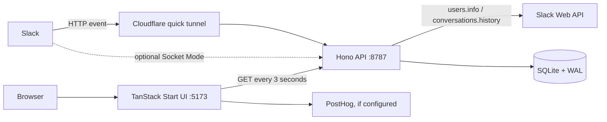

# StampHog codebase research

_Reviewed 29 August 2026. This document reflects commit `7800bc3` on `main`._

## Executive summary

StampHog is a small, single-workspace Slack application that gamifies pull-request review. It watches for top-level Slack messages containing a GitHub or Graphite URL, turns selected emoji reactions into one-point “stamps,” and presents 7–90 day giver/requester leaderboards plus a recent-activity feed.

The current system is intentionally local-first:

- a TanStack Start/React UI on port 5173;
- a separate Hono/Node API on port 8787;
- a local SQLite database accessed synchronously through Drizzle and `better-sqlite3`;
- Slack events delivered either through a Cloudflare HTTP tunnel or, despite the README saying otherwise, an optional Socket Mode connection;
- browser polling every three seconds rather than a pushed realtime channel.

The recent `7800bc3` commit replaced Convex with this local API and SQLite design. The result is understandable and appropriately small for a side project, with deterministic fixtures and good idempotency on event creation. The main gaps are at the Slack boundary: event handling can exceed Slack’s three-second acknowledgement deadline, reaction-removal retries can delete unrelated rows through an overly broad fallback, URL verification accepts an invalid signature, and the public tunnel exposes read APIs containing Slack identities and PR URLs.

## What the product actually does

The canonical behavior lives in code, primarily [`src/lib/slack-rules.ts`](src/lib/slack-rules.ts), [`server/slack/handlers.ts`](server/slack/handlers.ts), and [`server/queries.ts`](server/queries.ts).

1. A top-level Slack message is accepted when its text contains the first HTTP(S) URL whose hostname is `github.com`, a GitHub subdomain, `graphite.dev`, or a Graphite subdomain.
2. The URL path is not validated. Despite the product copy, any URL on those hosts qualifies; it does not have to be a pull request.
3. A qualifying message creates one request row, deduplicated by channel and Slack message timestamp.
4. A tracked reaction creates a one-stamp event, deduplicated by channel, message timestamp, normalized emoji, and giver.
5. Removing the reaction deletes the matching event.
6. Thread replies, Slack message subtypes, untracked emoji, and messages without a qualifying host are ignored.
7. The UI independently fetches the leaderboard and recent events every three seconds.

There are 20 emoji keys in `STAMP_EMOJIS`, not the 19 claimed in the README. Two—`white_check_mark` and `heavy_check_mark`—use standard Twemoji images; the rest point at workspace-specific Slack emoji assets.

The README also says requesters appear with zero stamps. They are stored and included in the request total, but [`getLeaderboard`](server/queries.ts) filters the requester ranking to `stampsRequested > 0`, so they do not actually appear in that leaderboard.

## Architecture and runtime flow

### Frontend

[`src/routes/index.tsx`](src/routes/index.tsx) is the only product page. It shows totals, an animated top-three podium, ranked giver/requester lists, a selectable date window, and recent events. TanStack Router loaders prefetch data into React Query. The date window and theme are persisted by TanStack server functions using cookies. PostHog records UI interactions when its public environment variables are configured.

The frontend imports API response types directly from [`server/queries.ts`](server/queries.ts). This is convenient in a monorepo, but it couples the browser build to the server module layout rather than to a neutral shared contract.

### API and ingestion

[`server/index.ts`](server/index.ts) exposes:

| Route | Purpose |
|---|---|
| `GET /health` | Basic process health |
| `GET /api/leaderboard` | Windowed and limited rankings/totals |
| `GET /api/events` | Merged recent request and stamp events |
| `POST /slack/stamps` | Slack URL verification and HTTP events |
| `GET /slack/stamps` | Human-readable endpoint check |

The read routes are unauthenticated and use wildcard CORS. The webhook retains the raw body for Slack HMAC verification, rejects timestamps older than five minutes, then dispatches message and reaction events.

For a reaction, the server calls `conversations.history` to recover the original message, URL, and requester. It then calls `users.info` for profiles and performs synchronous SQLite writes. Creation is idempotent because requests and stamp events have unique dedupe keys.

The model assumes one Slack workspace. The event envelope does not retain Slack's `team_id` or `event_id`, and neither actors nor dedupe keys are namespaced by workspace. Installing the same app into multiple unrelated workspaces would mix rankings and could create identifier collisions.

### Storage

[`server/db.ts`](server/db.ts) creates three tables:

- `actors`: Slack/user identity, display name, avatar, last update time;
- `requests`: requester, channel, Slack timestamp, occurrence time, PR URL, and unique dedupe key;
- `stamp_events`: giver, requester, count, source emoji, channel, PR URL, time, and unique dedupe key.

SQLite runs in WAL mode for file-backed databases. That is a sensible fit for one local Node process: SQLite documents that WAL usually improves performance and allows readers and a writer to proceed concurrently, although there can still be only one writer at a time. WAL requires the database and its companion files to stay on the same host and is not suitable for a network filesystem ([SQLite WAL documentation](https://www.sqlite.org/wal.html)).

Schema setup is handwritten `CREATE TABLE IF NOT EXISTS` SQL, not a versioned migration system. It initializes a new database reliably but cannot evolve an existing table when columns or constraints change.

### Queries and data volume

Leaderboard aggregation is performed in JavaScript: all matching request/stamp rows and all actors are loaded, grouped in maps, sorted, and sliced. This keeps the implementation simple and is reasonable for a small workspace and a 90-day UI window. It will eventually use unnecessary memory and CPU because live data is retained indefinitely and the API also permits an all-time query. SQL aggregation would be the natural next step only after real usage warrants it.

Recent events are fetched separately from each activity table, merged, sorted, and sliced in memory. The indexes on `occurred_at` support the two initial reads.

## Operational paths

### Development and fixtures

`pnpm dev` launches the Vite UI and Hono API together. `pnpm seed` replaces only fixture-prefixed data unless `--reset` is supplied. The fixture generator is deterministic (Faker seed `42024`) and creates 72 actors, 220 requests, and several hundred stamps spread over roughly 73 days. This is a good local demo path and does not require Slack.

### HTTP event delivery

The documented path tunnels only port 8787 through a random `trycloudflare.com` hostname. Cloudflare explicitly describes Quick Tunnels as development/testing infrastructure, with no uptime guarantee and a 200 in-flight request cap ([Cloudflare Quick Tunnels](https://developers.cloudflare.com/cloudflare-one/networks/connectors/cloudflare-tunnel/do-more-with-tunnels/trycloudflare/)). That matches this repository’s local-development goal, not a durable deployment.

### Socket Mode

[`server/slack/socket.ts`](server/slack/socket.ts) starts automatically when `SLACK_APP_TOKEN` and `SLACK_BOT_TOKEN` are present, and `.env.example` advertises the app token. This conflicts with `plan.md` and the README’s instruction that Socket Mode must be off. Slack confirms the modes are alternatives: with Socket Mode on, events arrive only over WebSocket and not at the HTTP Request URL ([Slack Socket Mode guide](https://docs.slack.dev/apis/events-api/using-socket-mode/)). The code can support either transport, but the project needs to choose and document one primary development path.

### Backfill

`pnpm backfill` scans comma-separated `CHANNEL_IDS`, capped at 90 days and 5,000 messages per channel by default. It caches user profiles and uses the same dedupe keys as live ingestion, so reruns are normally safe.

Backfilled stamp times are the message timestamps because Slack history does not provide the reaction time. Live stamps use the reaction event time. A 30-day leaderboard can therefore classify the same approval differently depending on whether it arrived live or through backfill.

## Key findings and risks

### 1. The public tunnel also exposes Slack-derived data

Cloudflare points at the entire API process, not only the webhook. Anyone who discovers the temporary hostname can call `/api/leaderboard` and `/api/events`; wildcard CORS also allows any website to read them from a browser. Responses contain display names, avatar URLs, repository/PR URLs, and activity relationships. This matters especially for private Slack channels or private repositories.

The simplest fixes are to require a read token, bind the UI and API behind the same authenticated access layer, or configure the public edge to expose only `/slack/stamps`. Random-host obscurity is not an access-control boundary.

### 2. HTTP events do too much work before acknowledging Slack

Slack requires an HTTP 2xx within three seconds, retries failed deliveries three times, and recommends acknowledging before processing ([Slack Events API](https://docs.slack.dev/apis/events-api/)). A reaction can currently wait on `conversations.history`, one or two `users.info` calls, and database work before responding. Network latency or rate limiting can therefore create retries even when the event eventually succeeds.

Creation dedupe prevents most double-counting, but the robust design is: verify, persist a unique envelope/job, return 200, then process asynchronously. For this local app, even a SQLite inbox table drained by the same process would be enough; a separate queue service is unnecessary.

### 3. A retried reaction removal can over-delete

[`removeReactionStamp`](server/ingest.ts) first deletes by the exact dedupe key. If that key no longer exists, it deletes **every** event matching giver, requester, channel, and emoji source—without message timestamp or PR URL.

After a successful removal, a Slack retry will miss the already-deleted key and enter this fallback. It can then delete the same giver’s stamps on other PR messages by the same requester in that channel. The fallback should be removed for normal retry handling or restricted to explicitly identified legacy rows. A tombstone/event-inbox dedupe would make removal retries harmless.

### 4. URL verification ignores a failed signature

Slack says URL verification should validate the request’s authenticity before returning its challenge ([Slack `url_verification` reference](https://docs.slack.dev/reference/events/url_verification/)). The HTTP handler calculates `signatureError`, logs whether it failed, but always returns the challenge with status 200. It should return the signature error when non-null. Signature verification should also happen before parsing untrusted JSON, since the raw body is already available.

### 5. Backfill pagination and rate-limit handling are brittle

The loop stops whenever a page has fewer than the requested 200 messages, even when Slack supplies a `next_cursor`. Cursor presence should be authoritative. This is particularly important because Slack may return fewer items than requested.

The client also has no `429`/`Retry-After` handling. Internal customer-built apps retain Tier 3 limits for `conversations.history`, while commercially distributed non-Marketplace apps can be limited to one request per minute and 15 results ([Slack rate limits](https://docs.slack.dev/apis/web-api/rate-limits/), [`conversations.history`](https://docs.slack.dev/reference/methods/conversations.history/)). StampHog appears intended as an internal app, but retry/backoff is still prudent.

### 6. Live and backfill rules are not identical

Backfill skips self-reactions; live ingestion counts them. Backfill timestamps approvals at message creation; live ingestion timestamps the reaction. These differences should either be accepted and documented or normalized so rebuilding the database does not change rankings.

### 7. Documentation and packaging have drifted

- Code tracks 20 emoji; README says 19.
- Zero-stamp requesters are stored but filtered out of the leaderboard.
- Socket Mode is implemented and configured but documented as forbidden.
- `plan.md` is a completed migration blueprint, not a current implementation plan.
- The lockfile is pnpm v9 format, but `package.json` does not pin a `packageManager` version. A machine with pnpm 8 cannot install it.
- There is Dependabot configuration but no CI workflow that runs tests, type checking, linting, or builds.

### 8. Retention and deployment assumptions need to stay explicit

Backfill is capped at 90 days, but live rows and actor profiles are never pruned. The UI’s date selector is a query filter, not a retention policy. A simple scheduled prune would limit personal-data retention and keep in-memory aggregation bounded.

The Vite configuration includes a Vercel Nitro preset, but the Hono/SQLite server is a separate local process and the database needs persistent local storage. Deploying the UI alone does not deploy a usable StampHog system; deploying SQLite to ephemeral or multi-host serverless storage would violate the current design assumptions.

## Product research: use the leaderboard as a nudge, not a performance metric

Research on gamification in software engineering reports engagement and motivation as common benefits, but also says the empirical evidence is limited ([systematic mapping of 103 studies](https://arxiv.org/abs/2011.07115)). A natural experiment around GitHub’s contribution streak found that visible gamification materially changed developer behavior, including one-contribution days and weekend activity, and warned that incentives can steer behavior in unwanted directions ([study](https://arxiv.org/abs/2006.02371)).

That supports the README’s playful disclaimer. Stamp count measures visible Slack reactions, not review quality, difficulty, turnaround time, correctness, or quiet review work done elsewhere. Practical product guardrails would be:

- keep rankings opt-in, playful, and team-scoped rather than using them for evaluation;
- add participation/coverage views alongside absolute totals so high-volume reviewers do not dominate every signal;
- watch for self-stamps, reciprocal stamping, emoji inflation, and review splitting;
- measure whether median review wait time or the share of PRs receiving review improves, not only whether stamp volume rises.

## Recommended next steps

### Immediate correctness and privacy

1. Restrict public access to `/api/*`, or expose only the Slack webhook through the tunnel.
2. Return URL-verification signature failures instead of the challenge.
3. Make `reaction_removed` retry-safe by eliminating or tightly constraining the broad fallback deletion.
4. Choose HTTP or Socket Mode as the supported path and align code, environment variables, and documentation.

### Reliability

1. Acknowledge HTTP events before Slack Web API lookups; use a small durable SQLite inbox with unique Slack `event_id` values.
2. Follow `next_cursor` regardless of page length and honor `429 Retry-After` responses.
3. Decide and test the semantics of self-stamps and backfill occurrence times.
4. Improve error reporting so a failed/rate-limited history lookup is not mislabeled as a thread reply.

### Maintainability

1. Add tests for URL extraction, signature verification, HTTP dispatch, removal retries, window boundaries, backfill pagination, and live/backfill parity.
2. Add CI for test, type check, lint, and build; pin pnpm via the `packageManager` field.
3. Introduce versioned Drizzle migrations before the next schema change.
4. Add a retention command/policy and document backup requirements for the database plus its WAL state.
5. Move shared API types out of the server query module; move aggregation into SQL only when data volume justifies it.

## Verification status

The review covered all application, server, configuration, test, and migration-plan files plus the recent Git history. The worktree was clean before this document was added.

Automated verification could not be run in the supplied checkout because `node_modules` is absent. Installation was also blocked: the available pnpm is 8.2.0 while `pnpm-lock.yaml` uses lockfile format 9, and the sandbox could not reach the npm registry. Therefore the findings above are based on static code tracing and official external documentation, not a successful local test/build run.
